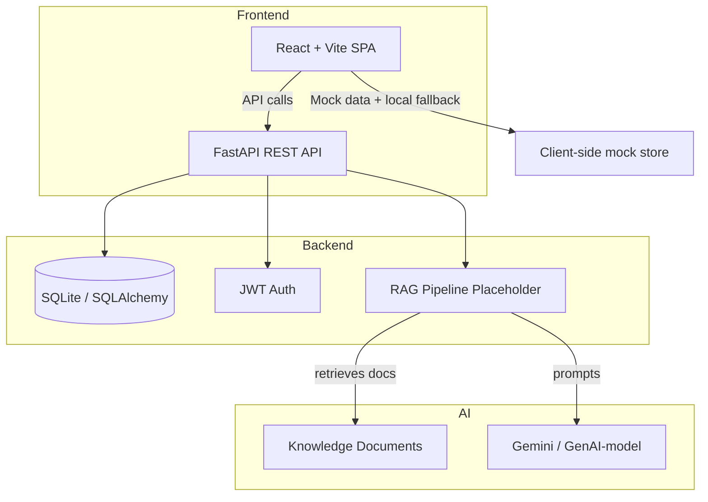

# Architecture

## Overview

The repository is organized as a full-stack monorepo. The frontend and backend are separate apps that communicate via HTTP. The backend holds the persistent domain model, authentication, ticket services, and RAG scaffolding. The frontend is a React single-page app that renders the user interface and interacts with backend API endpoints.

## Frontend

- `frontend/src/App.tsx` configures routing and layout.
- `frontend/src/shared/AppContext.tsx` provides global application state, authentication simulation, and integration with backend API clients.
- `frontend/src/shared/api.ts` contains HTTP client wrappers, token management, and mapping logic between backend payloads and frontend models.
- `frontend/src/pages/` contains the user interface pages.
- `frontend/src/components/Sidebar.tsx` implements the global navigation layout.
- `frontend/src/shared/types.ts` defines types for users, tickets, comments, knowledge articles, and stats.

## Backend

- `backend/app/main.py` boots FastAPI, configures middleware, opens the database, and seeds demo data.
- `backend/app/api/` defines routers for health, auth, chat, tickets, documents, and admin.
- `backend/app/auth/` contains JWT token creation/validation and authorization dependencies.
- `backend/app/database/` contains SQLAlchemy engine configuration, base class, session dependency, and demo seed workflow.
- `backend/app/models/` contains ORM models for users, tickets, comments, knowledge documents, chat history, and audit logs.
- `backend/app/schemas/` contains Pydantic schemas for request/response typing.
- `backend/app/services/` implements ticket CRUD business logic.
- `backend/app/rag/` currently contains placeholder pipeline scaffolding.
- `backend/app/prompts/` contains system instructions for the AI assistant.

## Database

The application is currently configured to use SQLite via SQLAlchemy. The default database is `sqlite:///./itsm_helpdesk.db`.

Tables:
- `users`
- `tickets`
- `ticket_comments`
- `knowledge_documents`
- `chat_history`
- `audit_logs`

Relationships:
- `Ticket.created_by` and `Ticket.assigned_to` reference `User.id`
- `TicketComment.ticket_id` references `Ticket.id`
- `TicketComment.author_id` references `User.id`
- `ChatHistory.user_id` references `User.id`
- `AuditLog.user_id` references `User.id`

## Authentication

The backend uses JWT-based authentication.
- `app/auth/security.py` produces and verifies tokens.
- `app/auth/dependencies.py` exposes `get_current_user` and `require_roles` for route protection.
- Token generation includes `access` and `refresh` tokens with expiration durations.
- Current routes use bearer authentication, but token claims are validated only for the auth endpoints.

## AI Layer

This repository is designed to support an AI-enabled helpdesk copilot.
- `backend/app/prompts/system_instructions.txt` holds the system prompt used by an AI model.
- `frontend` includes simulated chat and knowledge retrieval in `AIChat.tsx`.
- `backend/app/rag/pipeline.py` is a placeholder for future RAG pipeline implementation.

## RAG Layer

The intended design is a retrieval-augmented generation layer with these components:
- Document ingestion (PDF, DOCX, or text sources).
- Text chunking and embedding generation.
- FAISS vector index for semantic retrieval.
- Retriever service that returns relevant passages.
- AI model orchestration with Gemini or another generative engine.

## Knowledge Base

- `knowledge_base/it_support_kb.json` is existing seed source content.
- `backend/app/models/knowledge_document.py` persists knowledge documents.
- `frontend` uses mock knowledge articles and a simulated retrieval experience.

## Deployment

The current repository is configured for local development only. Typical deployment steps would include:
- Containerizing frontend and backend.
- Switching the backend database to PostgreSQL or another managed relational database.
- Securing JWT secrets and environment variables.
- Configuring CORS for the frontend domain.
- Deploying the frontend as static assets behind a CDN or app server.
- Deploying the backend to a managed container service or VM.

## Future Integrations

Recommended next-phase integrations:
- Real Gemini or OpenAI endpoint for AI chat.
- Document ingestion and AI-assisted answer sourcing.
- A persistent vector store (FAISS, Milvus, Pinecone).
- Email/Slack notifications for ticket updates.
- External ITSM systems (ServiceNow, Jira Service Management).
- Audit logging and analytics.

## Architecture Diagram

